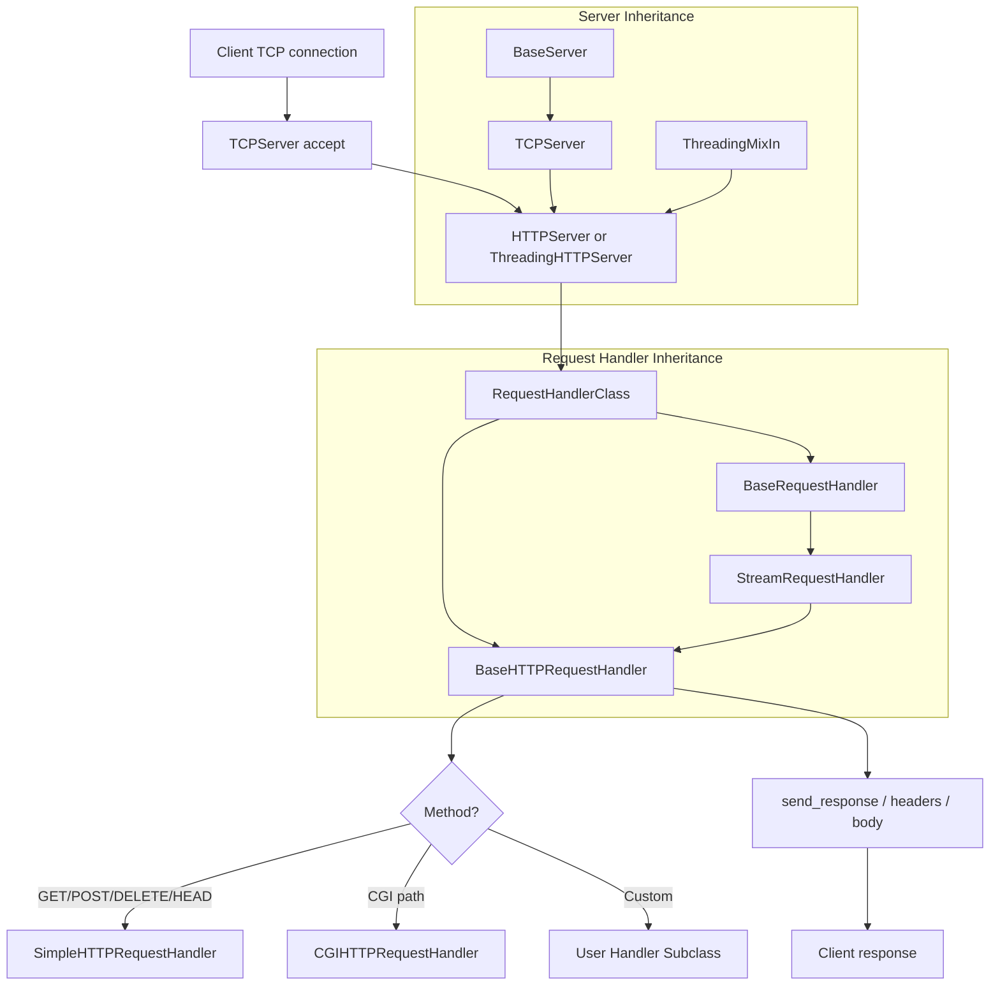
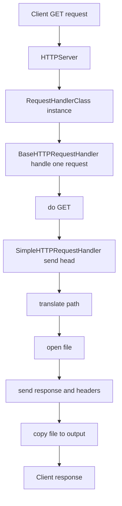
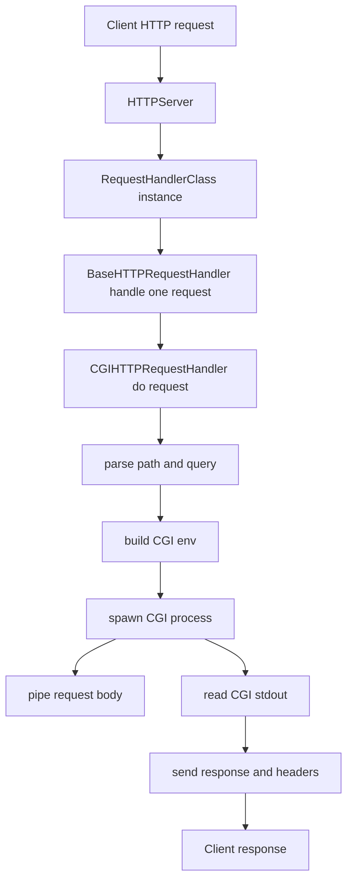

*This project has been created as part of the 42 curriculum by , afelger*

# WEBSERV

## A 42 webserver project

## Outline

A webserver takes requests over a tcp/ip socket and answers.
The Protocol is HTTP/1.1 and can be HTTP/2.0


## Requirements
use only one POLL() call
```
[poll] waits for one of a set of file descriptors to become ready to perform I/O.

The set of file descriptors to be monitored is specified in the fds argument, which is an array of structures of the following form:

    struct pollfd {
        int   fd;         /* file descriptor */
        short events;     /* requested events */
        short revents;    /* returned events */
    };

The caller should specify the number of items in the fds array in nfds.
```

```
- Your program must use a configuration file, provided as an argument on the command line, or available in a default path.
- You cannot execve another web server.
- Your server must remain non-blocking at all times and properly handle client disconnections when necessary.
- It must be non-blocking and use only 1 poll() (or equivalent) for all the I/O
operations between the clients and the server (listen included).
- poll() (or equivalent) must monitor both reading and writing simultaneously.
- You must never do a read or a write operation without going through poll() (or
equivalent).
- Checking the value of errno to adjust the server behaviour is strictly forbidden
after performing a read or write operation.
- You are not required to use poll() (or an equivalent function) for regular disk files;
read() and write() on them do not require readiness notifications.
When using poll() or any equivalent call, you can use every associated macro or
helper function (e.g., FD_SET for select()).
- A request to your server should never hang indefinitely.
- Your server must be compatible with standard web browsers of your choice.
- NGINX may be used to compare headers and answer behaviours (pay attention to
differences between HTTP versions).
- Your HTTP response status codes must be accurate.
- Your server must have default error pages if none are provided.
- You can’t use fork for anything other than CGI (like PHP, or Python, and so forth).
- You must be able to serve a fully static website.
- Clients must be able to upload files.
- You need at least the GET, POST, and DELETE methods.Stress test your server to ensure it remains available at all times.
- Your server must be able to listen to multiple ports to deliver different content (see Configuration file).
```
### Configuration File
```
In the configuration file, you should be able to:
• Define all the interface:port pairs on which your server will listen to (defining multiple websites served by your program).
• Set up default error pages.
• Set the maximum allowed size for client request bodies.
• Specify rules or configurations on a URL/route (no regex required here), for a
website, among the following:
◦ List of accepted HTTP methods for the route.
◦ HTTP redirection.
◦ Directory where the requested file should be located (e.g., if URL /kapouet
is rooted to /tmp/www, URL /kapouet/pouic/toto/pouet will search for
/tmp/www/pouic/toto/pouet).
◦ Enabling or disabling directory listing.
◦ Default file to serve when the requested resource is a directory.
◦ Uploading files from the clients to the server is authorized, and storage location
is provided.
10
Webserv This is when you finally understand why URLs start with HTTP
◦ Execution of CGI, based on file extension (for example .php). Here are some
specific remarks regarding CGIs:
∗ Do you wonder what a CGI is?
∗ Have a careful look at the environment variables involved in the web
server-CGI communication. The full request and arguments provided by
the client must be available to the CGI.
∗ Just remember that, for chunked requests, your server needs to un-chunk
them, the CGI will expect EOF as the end of the body.
∗ The same applies to the output of the CGI. If no content_length is
returned from the CGI, EOF will mark the end of the returned data.
∗ The CGI should be run in the correct directory for relative path file access.
∗ Your server should support at least one CGI (php-CGI, Python, and so
forth).
You must provide configuration files and default files to test and demonstrate that
every feature works during the evaluation.
You can have other rules or configuration information in your file (e.g., a server name
for a website if you plan to implement virtual hosts).
```
### Readme
```
A README.md file must be provided at the root of your Git repository. Its purpose is
to allow anyone unfamiliar with the project (peers, staff, recruiters, etc.) to quickly
understand what the project is about, how to run it, and where to find more information
on the topic.
The README.md must include at least:
• The very first line must be italicized and read: This project has been created as part
of the 42 curriculum by <login1>[, <login2>[, <login3>[...]]].
• A “Description” section that clearly presents the project, including its goal and a
brief overview.
• An “Instructions” section containing any relevant information about compilation,
installation, and/or execution.
• A “Resources” section listing classic references related to the topic (documentation, articles, tutorials, etc.), as well as a description of how AI was used —
specifying for which tasks and which parts of the project.
➠ Additional sections may be required depending on the project (e.g., usage
examples, feature list, technical choices, etc.).
Any required additions will be explicitly listed below.
```

## Architecture

A central class for the App. It takes as an argument the configuration file.
It start then the server, and has a loop to listen for incoming connections.
I would follow the HttpServer from [Python3](https://github.com/python/cpython/blob/main/Lib/http/server.py)

## Python3 http.server architecture

### Class and input overview

- `socketserver.BaseServer`
    - Inputs: `server_address`, `RequestHandlerClass`
    - Role: Core server loop, request dispatching.
- `socketserver.TCPServer`
    - Inputs: `server_address`, `RequestHandlerClass`, `bind_and_activate=True`
    - Role: TCP socket setup and accept loop.
- `http.server.HTTPServer`
    - Subclass of `socketserver.TCPServer`
    - Inputs: `server_address`, `RequestHandlerClass`
    - Role: HTTP-specific server (supports address reuse by default).
- `http.server.ThreadingHTTPServer`
    - Subclass of `HTTPServer` + `socketserver.ThreadingMixIn`
    - Inputs: `server_address`, `RequestHandlerClass`
    - Role: One thread per request.
- `socketserver.BaseRequestHandler`
    - Input: `request`, `client_address`, `server`
    - Role: Per-connection handler base.
- `socketserver.StreamRequestHandler`
    - Subclass of `BaseRequestHandler`
    - Input: `rbufsize`, `wbufsize`
    - Role: File-like `rfile`/`wfile` for stream I/O.
- `http.server.BaseHTTPRequestHandler`
    - Subclass of `StreamRequestHandler`
    - Inputs: parsed request line, headers
    - Role: Parses HTTP, dispatches to `do_*`.
- `http.server.SimpleHTTPRequestHandler`
    - Subclass of `BaseHTTPRequestHandler`
    - Inputs: `directory` (optional)
    - Role: Serves files, directory listing.
- `http.server.CGIHTTPRequestHandler`
    - Subclass of `SimpleHTTPRequestHandler`
    - Inputs: `cgi_directories`
    - Role: Runs CGI scripts.

### Mermaid diagram (connections and data flow)



### Mermaid diagram (GET static file call chain)



### Mermaid diagram (CGI request call chain)


