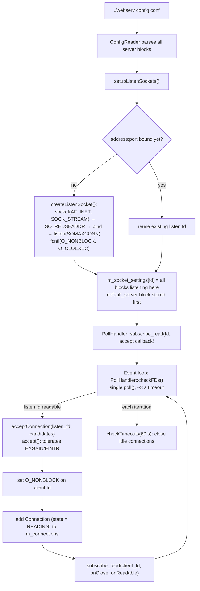
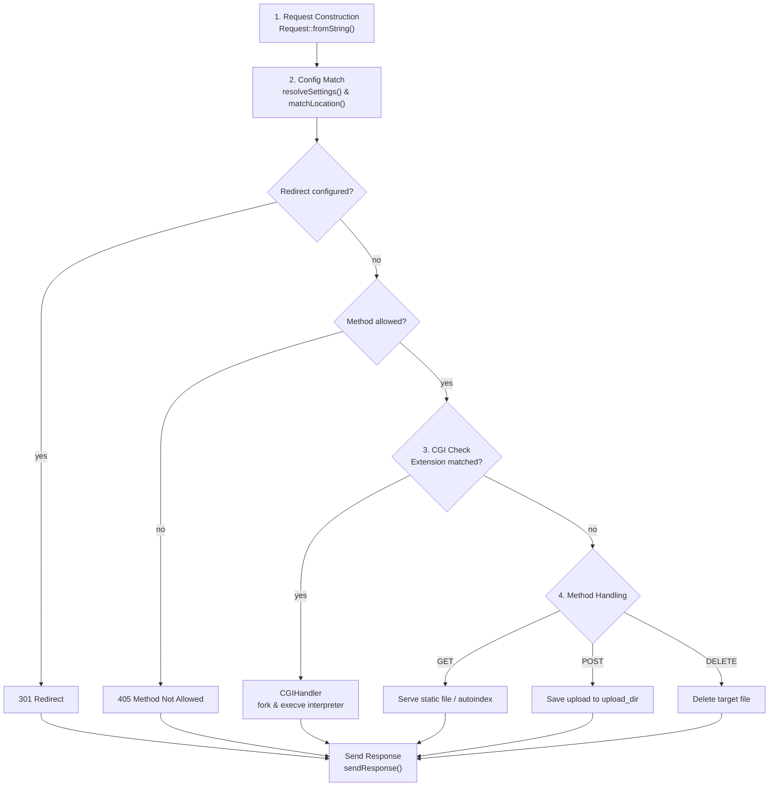

_This project has been created as part of the 42 curriculum by afelger, dabierma, jpflegha._

# webserv

A single-process, event-driven **HTTP/1.1 web server** written in **C++17**, developed for the 42 _webserv_ project.

## Description

`webserv` accepts TCP connections, reads and parses HTTP/1.1 requests, and answers with accurate status codes — just like a miniature NGINX. All I/O between the server, its listening sockets and the clients is multiplexed through **exactly one `poll()` call**; the server never blocks on a read or write and stays responsive under load.

It can serve fully static websites, accept file uploads, run CGI scripts (e.g. Python, PHP-CGI), decode `Transfer-Encoding: chunked` request bodies, and host several websites (virtual hosts) on the same or multiple ports — all driven by an nginx-style configuration file.

## Features

- **Non-blocking core** — a central event loop (`PollHandler`) wraps the single `poll()` call; read/write/close callbacks are dispatched per file descriptor. Idle connections are reaped after 60 s.
- **HTTP/1.1 request parsing** (`Request`, `URL`) — request line + headers (case-insensitive lookup) + body framed either by `Content-Length` or `chunked`. Requests combining both framing mechanisms (smuggling attempt) are rejected. Malformed input maps to accurate status codes: `400`, `405`, `413`, `431`, `501`, `505`.
- **Methods** — `GET`, `POST`, `DELETE` end-to-end (handlers for `HEAD`/`OPTIONS` are present as well).
- **Virtual hosts & multi-port** — many `server` blocks may share one listen socket; the target site is picked from the `Host` header, falling back to the block flagged `default_server`.
- **Routing** — nginx-style longest-prefix `location` matching, per-route method restrictions (answered with `405` + `Allow`) and whole-route redirects (`301`).
- **Static content** — MIME-type detection, `Last-Modified`, directory index files, optional HTML directory listing.
- **Uploads / deletes** — `POST` stores bodies in the configured `upload_dir` (`201 Created` + `Location`), `DELETE` removes files inside the document root.
- **CGI** — extension-based dispatch (e.g. `.py`, `.php`) via `fork`/`execve`; the full CGI/1.1 environment is provided (`QUERY_STRING`, `CONTENT_*`, `HTTP_*`, …), chunked bodies are decoded before execution, CGI output pipes are drained through the same poll loop, and children are reaped asynchronously via `signalfd`.
- **Chunked transfer decoding** (`Chunked`) — incremental hex-size chunk parsing with trailer support and overflow protection.
- **Hardening** — lexical path containment (`PathUtils::resolveUnder` denies dot-segment traversal), header-size guard (`431`), body-size cap (`413`).
- **Error pages** — custom pages per status code via config, plus generated built-in default pages.
- **Graceful shutdown** — `SIGINT`/`SIGTERM` stop the loop and close all sockets cleanly.

## Instructions

### Requirements

- Linux
- `make` and a C++ compiler supporting C++17
- `python3` for testing
- for cgi scripts: interpreter installed

### Build

```bash
make          # build ./webserv   (-Wall -Wextra -Werror -std=c++17)
make clean    # remove object files
make fclean   # also remove the binary
make re       # rebuild from scratch
```

### Run

```bash
./webserv <config_file.conf>     # exactly one argument ending in .conf
```

A ready-made example lives in [`test.conf`](test.conf); with it the server listens on `http://localhost:8080`.

### Run the tests

```bash
make tests        # build and run every unit test suite
make testURL      # or a single suite, e.g. testRequest, testConfigReader,
                  # testChunked, testPollHandler, testHttpResponse,
                  # testWebserverSettings, testHttpStatusReason, testCGI
```

Integration checks (require a running server):

```bash
./webserv www/test/test.conf &
python3 www/test/vhost_test.py     # virtual-host behaviour
python3 www/test/chunked_test.py   # chunked upload behaviour
```

`tests/dos.py` is a small stress script to verify availability under load.

## Configuration

### File format

The configuration uses nginx-like blocks and is parsed by `ConfigReader` / `WebserverSettings`:

- The file consists of one or more `server { ... }` blocks; each may contain any number of `location <path> { ... }` sub-blocks.
- `#` starts a comment; keywords are case-insensitive; values are whitespace-trimmed.
- The trailing `;` after a value is accepted but optional.
- Unknown directives produce a warning on stdout but do not abort startup.
- Any directive that fails validation aborts startup — a partially broken config is rejected as a whole.

### Writing your first config

Save the following as `myserver.conf` and start it with `./webserv myserver.conf`:

```nginx
server {
    listen 8080;                        # port only -> binds 0.0.0.0
    server_name localhost;
    root www;                           # document root for this site
    index index.html;                   # served when a directory is requested
    dirindex off;

    location / {
        # inherits everything from the server block
    }

    location /upload {
        upload_dir www/uploads;         # POST /upload/<name> writes here
        methods post delete;
    }

    location /scripts {
        cgi .py /usr/bin/python3;       # *.py below /scripts runs as CGI
    }
}

# Second site on the SAME port - selected by Host header.
# Also the fallback for names that match no other block on this socket.
server {
    listen 8080 default_server;
    server_name api.example.com;
    root www/site2;
}

# Separate admin port with stricter limits.
server {
    listen 127.0.0.1:8081;
    root /srv/admin;
    max_body_size 10485760;             # 10 MB
    max_header_size 8192;               # 8 KB
    error_page 404 /errors/404.html;
}
```

### Directive reference

| Directive              | Scope            | Example                                                                           | Default           | Behaviour                                                                                                                                                        |
| ---------------------- | ---------------- | --------------------------------------------------------------------------------- | ----------------- | ---------------------------------------------------------------------------------------------------------------------------------------------------------------- |
| `listen`               | server           | `listen 127.0.0.1:8080;`                                                          | address `0.0.0.0` | `<[address:]port>`; repeatable. Sockets shared by identical `address:port` are created only once. Only one block per socket may carry the `default_server` flag. |
| `server_name`          | server           | `server_name example.com api.example.com;`                                        | —                 | Whitespace-separated list; matched case-insensitively against the `Host` header (port stripped).                                                                 |
| `root`                 | server, location | `root www/site1;`                                                                 | —                 | Document root; a location value overrides the server value.                                                                                                      |
| `index`                | server, location | `index index.html;`                                                               | `index.html`      | File appended for directory requests.                                                                                                                            |
| `dirindex`             | server, location | `dirindex on;`                                                                    | off               | `on`/`true` enables HTML directory listings.                                                                                                                     |
| `methods`              | server, location | `methods get post delete;`                                                        | all allowed       | Lowercase method names; absent or empty means every method is permitted.                                                                                         |
| `redirect`             | server, location | `redirect https://example.org/new;`                                               | —                 | Matching requests are answered with `301` + `Location`.                                                                                                          |
| `error_page`           | server, location | `error_page 404 /errors/404.html;`                                                | built-in pages    | Repeatable; path resolved against the effective root.                                                                                                            |
| `max_body_size`        | server           | `max_body_size 10485760;`                                                         | `1000000` (1 MB)  | Larger request bodies are rejected with `413`.                                                                                                                   |
| `max_header_size`      | server           | `max_header_size 8192;`                                                           | `16384` (16 KB)   | Oversized header blocks are rejected with `431`.                                                                                                                 |
| `upload_dir`           | server, location | `upload_dir www/uploads;`                                                         | —                 | Required for `POST`; without it uploads answer `403`.                                                                                                            |
| `missing_content_type` | server, location | `missing_content_type reject;` · `missing_content_type default application/json;` | `reject`          | Controls POST bodies lacking `Content-Type`: reject with `400`, or synthesize the given type.                                                                    |
| `cgi`                  | server, location | `cgi .py /usr/bin/python3;`                                                       | —                 | `<extension> <interpreter>`; repeatable. Drives CGI dispatch by URL extension.                                                                                   |
| `max_cgi_output`       | server, location | `max_cgi_output 2000000;`                                                         | `2000000`         | Reserved CGI output cap.                                                                                                                                         |

## Architecture

### Components

| Component                                                  | Responsibility                                                                                                                                                    |
| ---------------------------------------------------------- | ----------------------------------------------------------------------------------------------------------------------------------------------------------------- |
| `main.cpp`                                                 | Argument check (`.conf`), constructs `Webserver`, runs it.                                                                                                        |
| `Webserver`                                                | Loads the config, creates listen sockets, owns the main loop, handles shutdown signals.                                                                           |
| `PollHandler`                                              | Meyers singleton around the single `poll()`; subscribe/unsubscribe read/write/close callbacks per fd.                                                             |
| `ConnectionManager`                                        | Per-connection state machine (`READING → PROCESSING → WRITING → CLOSED`): accept, buffering, body framing, dispatch to handlers, response writing, timeout sweep. |
| `ConfigReader` / `WebserverSettings`                       | Parse `.conf` text into validated settings structs (server blocks + locations).                                                                                   |
| `Request` / `URL`                                          | HTTP message parsing; URL validation, query-string and file-extension extraction.                                                                                 |
| `HttpResponse` / `HttpStatusReason` / `StandardErrorPages` | Response serialization (status line, headers, auto `Content-Length`/`Date`), reason phrases, default error pages, directory listing HTML.                         |
| `CGIHandler`                                               | CGI environment setup, `fork`/`execve`, non-blocking pipe draining, async child reaping via `signalfd`.                                                           |
| `Chunked`                                                  | Incremental chunked-body decoder.                                                                                                                                 |
| `PathUtils`                                                | Lexical path safety: query stripping, dot-segment rejection, resolving paths strictly under a root/upload dir.                                                    |

### Connection accepting

At startup every unique `address:port` gets exactly one non-blocking listen socket, shared by all `server` blocks that reference it. The block marked `default_server` is remembered first among the candidates for that socket (a second `default_server` on the same socket aborts startup). Each socket is subscribed for readability; whenever it becomes readable, one connection is accepted and registered with the poller.


```mermaid
flowchart TD
    S["./webserv config.conf"] --> CFG["ConfigReader parses all server blocks"]
    CFG --> SETUP["setupListenSockets()"]
    SETUP --> NEW{"address:port bound yet?"}
    NEW -- "no" --> CREATE["createListenSocket():<br/>socket(AF_INET, SOCK_STREAM) → SO_REUSEADDR → bind → listen(SOMAXCONN)<br/>fcntl(O_NONBLOCK, O_CLOEXEC)"]
    NEW -- "yes" --> REUSE["reuse existing listen fd"]
    CREATE --> REG["m_socket_settings[fd] = all blocks listening here<br/>default_server block stored first"]
    REUSE --> REG
    REG --> SUB["PollHandler::subscribe_read(fd, accept callback)"]
    SUB --> LOOP["Event loop: PollHandler::checkFDs()<br/>single poll(), ~3 s timeout"]

    LOOP -->|"listen fd readable"| ACC["acceptConnection(listen_fd, candidates)<br/>accept(); tolerates EAGAIN/EINTR"]
    ACC --> NB["set O_NONBLOCK on client fd"]
    NB --> STORE["add Connection (state = READING) to m_connections"]
    STORE --> CSUB["subscribe_read(client_fd, onClose, onReadable)"]
    CSUB --> LOOP

    LOOP -->|"each iteration"| TO["checkTimeouts(60 s): close idle connections"]
```

### Request flow

Everything below happens inside the single event loop. Reads append into a per-connection buffer until the request is completely framed; only then is it parsed and dispatched. Responses are buffered and flushed on writability, so no call ever blocks.


```mermaid
flowchart TD
    REQ["1. Request Construction<br/>Request::fromString()"] --> CONF["2. Config Match<br/>resolveSettings() & matchLocation()"]
    
    CONF --> RED{"Redirect configured?"}
    RED -- "yes" --> R301["301 Redirect"]
    RED -- "no" --> CHK_M{"Method allowed?"}
    
    CHK_M -- "no" --> R405["405 Method Not Allowed"]
    CHK_M -- "yes" --> CGI{"3. CGI Check<br/>Extension matched?"}
    
    CGI -- "yes" --> RUN_CGI["CGIHandler<br/>fork & execve interpreter"]
    CGI -- "no" --> METH{"4. Method Handling"}
    
    METH -- "GET" --> H_GET["Serve static file / autoindex"]
    METH -- "POST" --> H_POST["Save upload to upload_dir"]
    METH -- "DELETE" --> H_DEL["Delete target file"]
    
    R301 --> RESP["Send Response<br/>sendResponse()"]
    R405 --> RESP
    RUN_CGI --> RESP
    H_GET --> RESP
    H_POST --> RESP
    H_DEL --> RESP
```

## Project layout

```
include/   headers
src/       sources
tests/     unit tests + tests/sample_cfg/ config fixtures
docs/      design notes (see docs/POST-Handling.md)
www/       demo sites, vhost roots and integration test kit (www/test/)
test.conf  minimal example configuration
Makefile   build + test targets
```

## Resources

- [RFC 9110 — HTTP Semantics](https://httpwg.org/specs/rfc9110.html)
- [RFC 9112 — HTTP/1.1](https://httpwg.org/specs/rfc9112.html)
- [MDN Web Docs — HTTP](https://developer.mozilla.org/en-US/docs/Web/HTTP)
- [nginx documentation](https://nginx.org/en/docs/) — reference for configuration style and routing/vhost behaviour
- [RFC 3875 - The Common Gateway Interface Version 1.1](https://www.rfc-editor.org/info/rfc3875/#section-4)

## Further Infos, not implemented:

- [The ultimate SO_LINGER page, or: why is my tcp not reliable](https://blog.netherlabs.nl/articles/2009/01/18/the-ultimate-so_linger-page-or-why-is-my-tcp-not-reliable)

### AI usage

AI assistants were used during this project as development aids for: discussing architecture and HTTP protocol edge cases (e.g. request-smuggling defence, chunked framing), generating initial drafts of unit tests, and writing/refining documentation including this README. All implementation code was written, reviewed and debugged by the team, and every final decision was made manually.
