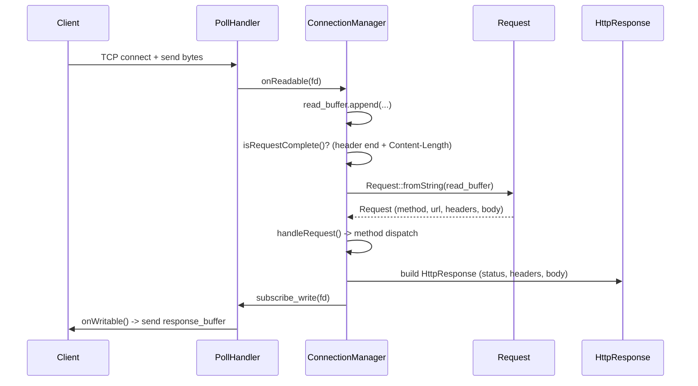
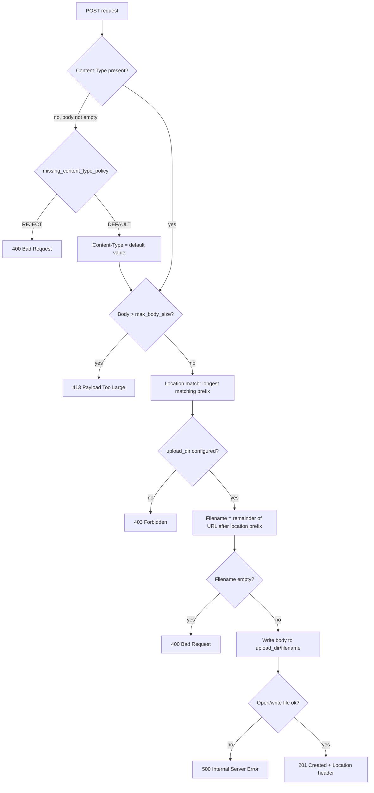

# POST Handling & Location Matching

This file explains the implementation of the `POST` request in
[`ConnectionManager.cpp`](../src/ConnectionManager.cpp) and the three bugs
that surfaced and were fixed along the way. Affected files:

- `src/ConnectionManager.cpp` — POST handler
- `src/Request.hpp` — header lookup (case-insensitivity)
- `src/WebserverSettings.cpp` — config parser (two bugs)

---

## 1. HTTP headers are case-insensitive

**RFC 9110 §5.1 (HTTP Semantics):**
> *"Field names are case-insensitive ... "*

A client can therefore send `Content-Type`, `content-type`, or `CONTENT-TYPE`
— the server must treat all three identically. There is no "correct" spelling
that a client is required to use.

### How this is implemented in the code

During **parsing** ([`Request.cpp:44-49`](../src/Request.cpp#L44-L49)), all
header keys are already lowercased before they are written into the
`std::map<std::string, std::string> headers`:

```cpp
std::transform(key.begin(), key.end(), key.begin(), [](unsigned char c) {
    return std::tolower(c);
});
req.headers[key] = value;
```

The problem: `getHeader()` in [`Request.hpp`](../src/Request.hpp) previously
searched with the **unmodified** lookup key:

```cpp
// BEFORE — Bug
const std::string& getHeader(const std::string& key) const {
    auto it = headers.find(key);   // key e.g. "Content-Type"
    ...
}
```

Since the caller in `ConnectionManager.cpp` looks up via
`req.getHeader("Content-Type")`, but the map only knows `"content-type"`
(lowercase) as a key, `find()` was **always** a miss — regardless of whether
the client sent the header or not. The server treated every POST request as if
the `Content-Type` were missing, and rejected it via the
`MissingContentTypePolicy::REJECT` rule with `400 Bad Request`.

### The fix

```cpp
// AFTER
const std::string& getHeader(const std::string& key) const {
    std::string lower_key = key;
    std::transform(lower_key.begin(), lower_key.end(), lower_key.begin(),
        [](unsigned char c) { return std::tolower(c); });
    auto it = headers.find(lower_key);
    ...
}
```

Now both insertion and lookup are reduced to the same normal form (lowercase)
— both sides speak the same "language." This is not a workaround but exactly
the behavior the spec requires: comparison is case-insensitive, while values
(i.e. the actual content of the header) remain untouched — only the **field
names** are normalized, never the values.

> **Note / limitation:** On the response side (`HttpResponse::addHeader`) no
> normalization is done. This is harmless, because there only server-owned
> headers with names hard-coded in the source are set (no client input) — so
> there are no two spellings that could collide.

---

## 2. Request flow: from socket to response



`isRequestComplete()` buffers bytes until the header end (`\r\n\r\n`) *and* the
complete body (per `Content-Length`) have arrived. Only then is
`handleRequest()` called, which parses the request and branches depending on
the method (`GET`/`HEAD`/`POST`/`DELETE`).

---

## 3. The POST handler in detail

Flow in [`ConnectionManager.cpp`](../src/ConnectionManager.cpp), branch
`else if (method == "POST")`:



**Example:** `POST /upload/foto.jpg` with location `/upload { upload_dir /var/uploads; }`
→ the file ends up at `/var/uploads/foto.jpg`, and the response is `201 Created`
with `Location: /upload/foto.jpg`.

### Key design decisions

- **Body limit checked before location match:** regardless of whether the
  location allows uploads at all, the request is first checked roughly against
  `settings->max_body_size` (server-wide; no per-location limit is currently
  implemented).
- **No automatic creation of subdirectories:** if the URL remainder contains
  further `/` (e.g. `POST /upload/sub/datei.txt`), the server tries to write
  directly to `upload_dir/sub/datei.txt`. If `sub/` does not exist,
  `ofstream::open` fails → `500`. This is deliberately kept simple; no
  directory structure is created automatically.
- **Path traversal:** not checked separately in the POST handler, because the
  `URL` regex in [`URL.hpp:13-15`](../src/URL.hpp#L13-L15) already rejects any
  occurrence of `/../` or `/./` during parsing — so a manipulated path never
  even reaches the handler.

---

## 4. Location matching: longest prefix (like nginx)

`conn.settings->locations` is a `std::map<std::string, LocationConfig>`, sorted
alphabetically. For `POST /upload/foo.txt`, both `"/"` and `"/upload"` match as
prefixes. A naive loop that stops at the first hit would **always** pick `"/"`
(it comes alphabetically before `"/upload"` and is a prefix of practically
every path).

The fix iterates over *all* locations and keeps the one with the **longest**
matching `path`:

```cpp
const LocationConfig* matched = nullptr;
for (const auto& loc : conn.settings->locations)
{
    if (url_path.compare(0, loc.second.path.size(), loc.second.path) == 0)
    {
        if (!matched || loc.second.path.size() > matched->path.size())
            matched = &loc.second;
    }
}
```

This is the same principle nginx uses for its `location` blocks without regex:
the most specific (longest) match wins.

> The existing GET/DELETE code (`ConnectionManager.cpp:231-239`, `:313-321`)
> still uses the "first hit wins" logic. This currently goes unnoticed because
> `test.conf` only has one location (`/`) — but as soon as multiple locations
> with overlapping prefixes are configured, GET/DELETE will have the same bug
> POST had before.

---

## 5. Fixed bugs — overview

| # | File | Line (before) | Bug | Impact | Fix |
|---|-------|------|-----|------------|-----|
| 1 | `Request.hpp` | `getHeader()` | Lookup key was not lowercased, but the map keys were | `getHeader("Content-Type")` never found anything → every POST was treated as "Content-Type missing" | Also lowercase the key on lookup |
| 2 | `WebserverSettings.cpp:90` | `else if (line.compare(0, 20, "client_max_body_size"))` | Missing `== 0` — the condition is true when the line does **not** match | As a catch-all it swallowed *every* `location` line in the `else if` chain before the `location` branch was ever reached → `settings.locations` stayed empty | Added `== 0` + actually parse the value into `settings.max_body_size` |
| 3 | `WebserverSettings.cpp` | Location parsing | `LocationConfig::path` was never set, only the map key | `loc.second.path` was always `""` → `url_path.compare(0, 0, "")` is *always* `0` (comparing 0 characters) → every location matched trivially, and the first one in the map iteration order was chosen | Set `parser.loc.path = parser.location_path;` when opening the location block |

Bugs #2 and #3 together prevented `/upload` locations from appearing in
`ws.locations` at all, or from being found during URL matching — while bug #1
additionally rejected every POST body request with `400` before it even reached
the location logic. All three had to be fixed for a single
`POST /upload/datei.txt` to work end-to-end.

---

## 6. Tests performed

Verified manually against a running server (`test.conf` with an added
`location /upload { upload_dir ...; }`) via `curl`:

| Request | Expected | Result |
|---|---|---|
| `POST /upload/testfile.txt` with body + `Content-Type` | `201 Created`, file lands in `upload_dir` | ✅ |
| `POST /root_test.txt` (location `/` without `upload_dir`) | `403 Forbidden` | ✅ |
| `POST /upload` (no filename after prefix) | `400 Bad Request` | ✅ |
| `POST /upload/big.bin` with 2 MB body (limit 1 MB) | `413 Payload Too Large` | ✅ |

Additionally: the existing test suites `testConfigReader`,
`testWebserverSettings`, and `testRequest` still run fully green (`make tests`,
with `testURL` excepted — it already fails on `main` without these changes, see
the missing include in `URL.hpp`).